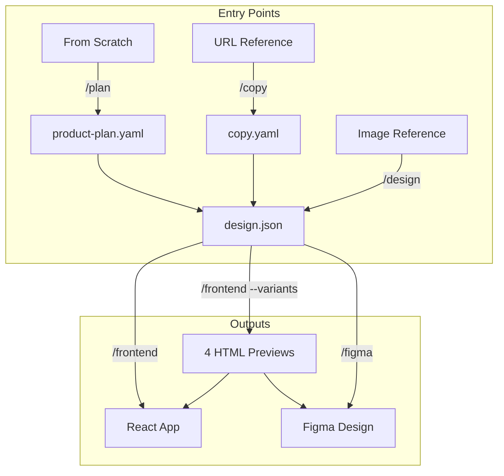

# Design Builder

Claude Code plugin that extracts copy and design from references to build frontend or Figma designs.

## Architecture

```
design-builder/
├── .claude-plugin/
│   └── plugin.json                 # Plugin manifest
├── agents/                         # Specialized subagents
│   ├── product-planner.md          # Product Strategist
│   ├── copy-extractor.md           # Content Strategist
│   ├── design-extractor.md         # Creative Director
│   ├── frontend-builder.md         # Frontend Engineer (React)
│   ├── variants-builder.md         # Design Engineer (HTML+CSS)
│   └── figma-builder.md            # Design Engineer (Figma)
├── commands/                       # Slash commands
│   ├── plan.md
│   ├── copy.md
│   ├── design.md
│   ├── frontend.md
│   └── figma.md
├── skills/                         # Auto-loaded guidance
│   └── frontend-design/SKILL.md
└── docs/                           # Output directory
    ├── product-plan.yaml
    ├── copy.yaml
    └── design.json
```

## Workflows



### Entry Points

| Entry | Command | When to Use |
|-------|---------|-------------|
| From scratch | `/design-builder:plan` | No reference, just an idea |
| URL | `/design-builder:copy` | Website as inspiration |
| Image | `/design-builder:design` | Screenshot/mockup as reference |

### Outputs

| Output | Command | For Who |
|--------|---------|---------|
| React | `/design-builder:frontend` | Dev wants code directly |
| Figma | `/design-builder:figma` | Designer wants to refine first |

## Commands

| Command | Description |
|---------|-------------|
| `/design-builder:plan` | Define product vision, data models, features |
| `/design-builder:copy` | Extract content from URL to copy.yaml |
| `/design-builder:design` | Extract design from images to design.json |
| `/design-builder:frontend` | Build React directly |
| `/design-builder:frontend --variants` | Generate 4 HTML previews, then build React |
| `/design-builder:figma` | Generate HTML for Figma import |

## Agents

| Agent | Role |
|-------|------|
| `product-planner` | Product Strategist - defines vision from scratch |
| `copy-extractor` | Content Strategist - extracts content from URLs |
| `design-extractor` | Creative Director - extracts design from images |
| `frontend-builder` | Frontend Engineer - builds React |
| `variants-builder` | Design Engineer - generates 4 HTML+CSS previews |
| `figma-builder` | Design Engineer - generates Figma-optimized HTML |

Agents can be invoked directly: "Use the design-extractor agent to analyze this image"

## Variant Presets

Each preset applies design guidelines (60-30-10, visual hierarchy, rhythm):

| Preset | Style | Hero | Spacing | Cards |
|--------|-------|------|---------|-------|
| `minimal` | Ultra clean | Text only | Extra generous | None |
| `editorial` | Magazine feel | Split 50/50 | Generous | Flat |
| `startup` | SaaS modern | Centered CTA | Balanced | Shadows |
| `bold` | High impact | Fullscreen | Compact | Bordered |

## Figma Export

Export to Figma using YashiTech plugin (40 imports/week free):

1. `/design-builder:figma` generates HTML at localhost:8081
2. Use Chrome Extension to capture
3. Import in Figma via plugin

**Requirements:**
- [Chrome Extension](https://chromewebstore.google.com/detail/html-to-figma-by-yashi-te/apgdhlibcimkkffajannbmpnbjaealmo)
- [Figma Plugin](https://www.figma.com/community/plugin/1459487250118622106)

## Skills

| Skill | Description |
|-------|-------------|
| `frontend-design` | Design principles auto-loaded for frontend tasks |

The frontend-builder and variants-builder agents MUST apply the frontend-design skill.

## Project Types

| Type | Description | Example |
|------|-------------|---------|
| `landing` | Single-page landing | Product page, lead capture |
| `website` | Multi-page site | Corporate, blog, portfolio |
| `webapp` | Interactive application | Dashboard, SaaS, admin panel |
| `app` | Mobile application | iOS/Android, PWA |

## Output Formats

### product-plan.yaml
- Project metadata and description
- Target audience and pain points
- Value proposition and features
- Structure (sections for landing, screens for webapp)
- Style direction and references

### copy.yaml
- `landing/website`: sections with hero, features, cta, footer
- `webapp`: screens with widgets, auth, sidebar navigation
- `app`: screens, onboarding, bottom-tabs, gestures, native features

### design.json
```json
{
  "meta": { "name", "version", "project_type" },
  "principles": { "overall", "keywords", "avoid" },
  "colors": { "primary", "accent", "neutral", "semantic" },
  "typography": { "fonts", "scale", "emphasis" },
  "spacing": { "section", "container", "grid", "component" },
  "components": { "button", "card", "badge", "input", "icon" },
  "effects": { "shadows", "transitions" },
  "animations": { "fadeInUp", "hoverLift", "stagger" },
  "backgrounds": { "patterns", "gradients", "sections" }
}
```

## References

- Workflow based on Deborah Folloni's method (DebGPT)
- [Original post](https://dfolloni.substack.com/p/os-prompts-que-eu-uso-para-fazer)
