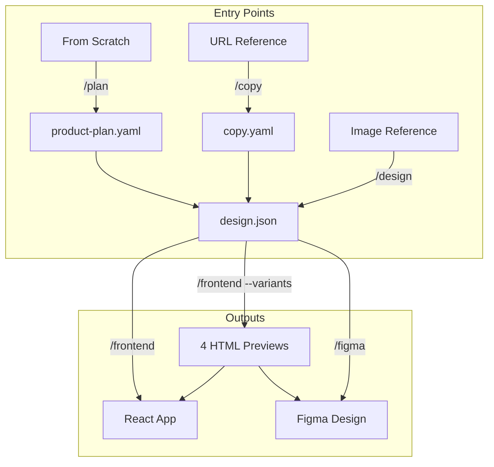

# Design Builder

Claude Code plugin that extracts copy and design from references to build frontend or Figma designs.

> **Part of [claude-code-extras](https://github.com/adeonir/claude-code-extras)** - A curated marketplace of Claude Code plugins for feature development, debugging, frontend generation, and git helpers.

## Features

- Product planning from scratch (vision, data models, features)
- Extract content structure from URLs
- Extract design tokens from reference images
- Build React components directly with Claude Code
- Export to Figma via YashiTech plugin (40 imports/week free)
- Generate 4 HTML+CSS preview variants before building
- Auto-loaded skill to avoid generic "AI slop" aesthetics

## Installation

### Prerequisites

- [Claude Code](https://claude.ai/code) - Anthropic's official CLI for Claude
- For Figma export: [YashiTech Chrome Extension](https://chromewebstore.google.com/detail/html-to-figma-by-yashi-te/apgdhlibcimkkffajannbmpnbjaealmo) + [Figma Plugin](https://www.figma.com/community/plugin/1459487250118622106)

### Add Marketplace

First, add the marketplace to Claude Code (only needed once):

```bash
/plugin marketplace add adeonir/claude-code-extras
```

### Install Plugin

```bash
/plugin install design-builder
```

## Workflows



### Entry Points

| Entry | Command | When to Use |
|-------|---------|-------------|
| From scratch | `/design-builder:plan` | No reference, just an idea |
| URL | `/design-builder:copy` | Website as inspiration |
| Image | `/design-builder:design` | Screenshot/mockup as reference |

### Outputs

| Output | Command | For Who |
|--------|---------|---------|
| React | `/design-builder:frontend` | Dev wants code directly |
| Figma | `/design-builder:figma` | Designer wants to refine first |

## Commands

| Command | Description |
|---------|-------------|
| `/design-builder:plan` | Define product vision, data models, features |
| `/design-builder:copy` | Extract content from URL to copy.yaml |
| `/design-builder:design` | Extract design from images to design.json |
| `/design-builder:frontend` | Build React in ./src/ |
| `/design-builder:frontend --variants` | Generate 4 HTML previews, then build React |
| `/design-builder:figma` | Generate HTML for Figma import |

## Agents

| Agent | Role |
|-------|------|
| `product-planner` | Product Strategist - defines vision from scratch |
| `copy-extractor` | Content Strategist - extracts content from URLs |
| `design-extractor` | Creative Director - extracts design from images |
| `frontend-builder` | Frontend Engineer - builds React |
| `variants-builder` | Design Engineer - generates 4 HTML+CSS previews |
| `figma-builder` | Design Engineer - generates Figma-optimized HTML |

## Skills

| Skill | Description |
|-------|-------------|
| `frontend-design` | Design principles that avoid generic AI aesthetics |

## Design Variants

Generate 4 HTML+CSS previews to compare before building:

```bash
/design-builder:frontend --variants
```

Generates:
```
./outputs/
  minimal/index.html    # Text hero, extra whitespace, no cards
  editorial/index.html  # Split hero, generous spacing, flat cards
  startup/index.html    # Centered hero, balanced, shadow cards
  bold/index.html       # Fullscreen hero, compact, bordered cards
  index.html            # Side-by-side comparison
```

Opens http://localhost:8080 for comparison. Tell Claude which variant you prefer (e.g., "use editorial").

### Variant Presets

| Preset | Style | Hero | Spacing | Cards |
|--------|-------|------|---------|-------|
| `minimal` | Ultra clean | Text only | Extra generous | None |
| `editorial` | Magazine feel | Split 50/50 | Generous | Flat |
| `startup` | SaaS modern | Centered CTA | Balanced | Shadows |
| `bold` | High impact | Fullscreen | Compact | Bordered |

## Figma Export

Export designs to Figma using the YashiTech plugin:

```bash
/design-builder:figma
```

**Requirements:**
- [Chrome Extension](https://chromewebstore.google.com/detail/html-to-figma-by-yashi-te/apgdhlibcimkkffajannbmpnbjaealmo)
- [Figma Plugin](https://www.figma.com/community/plugin/1459487250118622106)

**Free tier:** 40 imports/week

## Project Types

| Type | Example |
|------|---------|
| `landing` | Product page, lead capture |
| `website` | Corporate, blog, portfolio |
| `webapp` | Dashboard, SaaS, admin panel |
| `app` | iOS/Android, PWA |

## Usage Examples

### From Scratch to Figma

```bash
# 1. Plan your product
/design-builder:plan --type=landing

# 2. Extract design (will use plan for context)
/design-builder:design
# Paste reference images

# 3. Export to Figma
/design-builder:figma
```

### URL to React

```bash
# 1. Extract content from URL
/design-builder:copy https://example.com --type=landing

# 2. Extract design from images
/design-builder:design
# Paste reference images

# 3. Build React
/design-builder:frontend
```

### Image to Variants to React

```bash
# 1. Extract design
/design-builder:design
# Paste images, provide brief description

# 2. Generate variants
/design-builder:frontend --variants

# 3. Compare at localhost:8080, then:
# "use editorial"
```

## Credits

Copy/design extraction workflow inspired by [Deborah Folloni's method](https://dfolloni.substack.com/p/os-prompts-que-eu-uso-para-fazer).

## License

MIT
