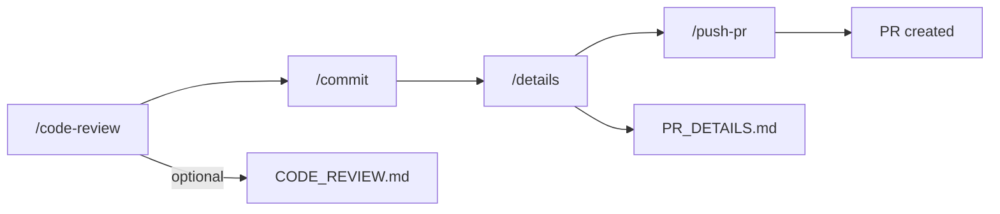

# git-helpers

Git workflow helper commands for Claude Code.

## Workflow



## Commands

| Command | Description |
|---------|-------------|
| `/git-helpers:code-review` | Review changes with confidence scoring |
| `/git-helpers:commit` | Create commit with auto-generated message |
| `/git-helpers:details` | Generate PR description to file |
| `/git-helpers:push-pr` | Push branch and create PR |

### /code-review

Review code changes using `code-reviewer` and `guidelines-auditor` agents.

```bash
/git-helpers:code-review              # Terminal, ask to save
/git-helpers:code-review main         # Compare against main
/git-helpers:code-review --comment    # Post to PR via gh
```

**Output modes:**
- Terminal (default): Shows review, asks to save to CODE_REVIEW.md
- PR comment (`--comment`): Posts review as PR comment via gh cli

### /commit

Create commits with well-formatted messages based on actual file changes.

```bash
/git-helpers:commit           # Stage all files and commit
/git-helpers:commit -s        # Commit only staged files
```

**Message format:** `type: concise description`

### /details

Generate PR title and description to `PR_DETAILS.md`.

```bash
/git-helpers:details          # Auto-detect base branch
/git-helpers:details main     # Use main as base
```

### /push-pr

Push branch and create Pull Request via gh cli.

```bash
/git-helpers:push-pr          # Auto-detect base branch
/git-helpers:push-pr main     # Use main as base
```

**Requires:** `gh` cli

## Agents

| Agent | Role |
|-------|------|
| `code-reviewer` | Bug detection, security, performance (>= 80 confidence) |
| `guidelines-auditor` | CLAUDE.md compliance checking (>= 80 confidence) |

## Confidence Scoring

| Score | Meaning | Action |
|-------|---------|--------|
| >= 80 | High confidence | Report as issue |
| 50-79 | Medium confidence | Investigate more |
| < 50 | Low confidence | Do not report |

## Output Format

```markdown
## Issues

- **[{score}] [{file}:{line}]** Issue description
  - Why and how to fix

## CLAUDE.md Compliance

- **[{score}] [{file}:{line}]** Guideline violation
  - Which guideline and how to fix

## Summary

X files | Y issues | Z compliance findings
```

## Commit Types

`feat`, `fix`, `refactor`, `chore`, `docs`, `test`
