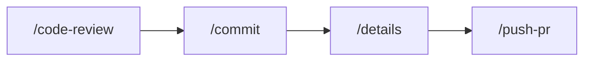

# git-helpers

Git workflow helper commands for Claude Code.

> **Part of [claude-code-extras](https://github.com/adeonir/claude-code-extras)** - A curated marketplace of Claude Code plugins for feature development, debugging, frontend generation, and git helpers.

## Features

- Confidence-scored code review (only reports >= 80 confidence)
- CLAUDE.md compliance checking
- Auto-generated commit messages from actual diffs
- Structured PR descriptions with impact assessment
- Direct PR creation via GitHub CLI

## Installation

### Prerequisites

- [Claude Code](https://claude.ai/code) - Anthropic's official CLI for Claude
- [gh](https://cli.github.com/) - GitHub CLI (required for `/push-pr` and `--comment`)

### Add Marketplace

First, add the marketplace to Claude Code (only needed once):

```bash
/plugin marketplace add adeonir/claude-code-extras
```

### Install Plugin

```bash
/plugin install git-helpers
```

## Commands

| Command | Description |
|---------|-------------|
| `/git-helpers:code-review` | Review changes with confidence scoring |
| `/git-helpers:commit` | Create commit with auto-generated message |
| `/git-helpers:details` | Generate PR description to file |
| `/git-helpers:push-pr` | Push branch and create PR |

## Workflow



## Usage

### /code-review

Review code changes using specialized agents.

```bash
/git-helpers:code-review              # Terminal, ask to save
/git-helpers:code-review main         # Compare against main
/git-helpers:code-review --comment    # Post to PR via gh
```

**Agents:**
- `code-reviewer`: Bug detection, security, performance
- `guidelines-auditor`: CLAUDE.md compliance checking

### /commit

Create a commit with an auto-generated message based on the actual diff.

```bash
/git-helpers:commit           # Stage all files and commit
/git-helpers:commit -s        # Commit only staged files
```

**Message format:** `type: concise description`

**Types:** `feat`, `fix`, `refactor`, `chore`, `docs`, `test`

### /details

Generate PR title and description and save to file.

```bash
/git-helpers:details          # Auto-detect base branch
/git-helpers:details main     # Use main as base
```

**Output:** `PR_DETAILS.md`

### /push-pr

Push branch and create Pull Request via gh cli.

```bash
/git-helpers:push-pr          # Auto-detect base branch
/git-helpers:push-pr main     # Use main as base
```

**Requires:** `gh` cli installed and authenticated.

**Output:** PR created, returns PR URL.

## Confidence Scoring

| Score | Meaning | Action |
|-------|---------|--------|
| >= 80 | High confidence | Report as issue |
| 50-79 | Medium confidence | Investigate more |
| < 50 | Low confidence | Do not report |

Only issues with >= 80 confidence are reported, reducing false positives.

## Output Format

```markdown
## Issues

- **[95] [src/api.ts:42]** SQL injection vulnerability
  - User input concatenated directly into query

## CLAUDE.md Compliance

- **[88] [src/utils.ts:15]** Naming convention violation
  - Guideline: "Always use descriptive variable names"

## Summary

12 files | 2 issues | 1 compliance finding
```

## Key Principles

- Analyzes actual file changes, not conversation context
- Messages reflect current implementation state
- Conservative review: only high-confidence issues
- Concise, actionable output

## License

MIT
