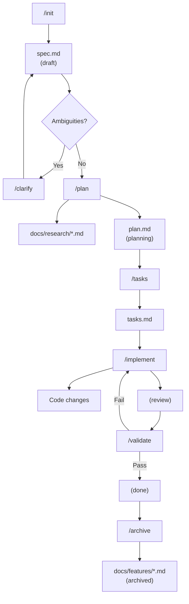
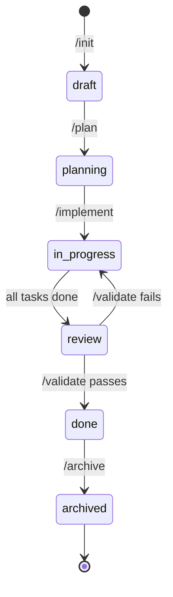

# Spec-Driven

Claude Code plugin for specification-driven development with persistent artifacts.

## Architecture

```
spec-driven/
├── .claude-plugin/
│   └── plugin.json
├── .mcp.json
├── agents/
│   ├── web-researcher.md
│   ├── code-explorer.md
│   ├── code-architect.md
│   ├── task-generator.md
│   ├── implement-agent.md
│   ├── spec-validator.md
│   └── spec-archiver.md
├── commands/
│   ├── init.md
│   ├── clarify.md
│   ├── plan.md
│   ├── tasks.md
│   ├── implement.md
│   ├── validate.md
│   ├── archive.md
│   └── specs.md
└── .specs/{ID}-{feature}/
    ├── spec.md
    ├── plan.md
    └── tasks.md
```

## Workflow



## Commands

| Command | Description |
|---------|-------------|
| `/spec-driven:init` | Create specification with sequential ID |
| `/spec-driven:init --link ID` | Associate current branch to existing feature |
| `/spec-driven:clarify [ID]` | Resolve ambiguities marked [NEEDS CLARIFICATION] |
| `/spec-driven:plan [ID]` | Research (if needed), explore codebase, generate technical plan |
| `/spec-driven:tasks [ID]` | Generate task list from plan |
| `/spec-driven:implement [ID] [scope]` | Execute next task, or specify scope (T001, T001-T005, --all) |
| `/spec-driven:validate [ID]` | Validate artifacts, consistency, and code |
| `/spec-driven:archive [ID]` | Generate documentation and mark as archived |
| `/spec-driven:specs` | List all features by status |

## Feature Organization

Features are organized by sequential ID:

```
.specs/
├── 001-user-auth/
├── 002-add-2fa/
└── 003-payment-flow/
```

Each spec.md has frontmatter metadata:

```yaml
---
id: 002
feature: add-2fa
status: draft | planning | in-progress | review | done | archived
branch: feat/add-2fa  # optional
created: 2025-01-03
---
```

## Status Lifecycle



## Agents

| Agent | Role |
|-------|------|
| `web-researcher` | Researches external technologies, outputs to docs/research/ |
| `code-explorer` | Discovers project documentation, traces feature implementations, maps architecture |
| `code-architect` | Reviews documentation context, creates technical plans with Requirements Traceability |
| `task-generator` | Decomposes plans into trackable tasks with Requirements Coverage |
| `implement-agent` | Executes tasks respecting dependencies |
| `spec-validator` | Validates artifacts, consistency, code quality, and planning completeness |
| `spec-archiver` | Generates documentation for completed features |

## Task Categories

| Category | Content |
|----------|---------|
| Foundation | base setup, types, config, dependencies |
| Implementation | core feature code, business logic |
| Validation | quality checks, tests, verification |
| Documentation | docs, comments, guides |

## Task Markers

| Marker | Meaning |
|--------|---------|
| `[P]` | Parallel-safe: can run alongside other [P] tasks |
| `[B:T001]` | Blocked: depends on T001 |
| `[B:T001,T002]` | Blocked: depends on T001 and T002 |
| `- [ ]` | Pending |
| `- [x]` | Completed |

## Persistent Artifacts

### Working Files (.specs/ - gitignored)

| File | Created By | Purpose |
|------|------------|---------|
| `spec.md` | /init | Feature requirements and acceptance criteria |
| `plan.md` | /plan | Technical architecture and implementation map |
| `tasks.md` | /tasks | Trackable task list with dependencies |

### Permanent Files (docs/ - committed)

| File | Created By | Purpose |
|------|------------|---------|
| `docs/research/{topic}.md` | /plan | Reusable research findings |
| `docs/features/{feature}.md` | /archive | Feature overview and architecture decisions |
| `docs/CHANGELOG.md` | /archive | Centralized project changelog |

## Context Flow

```
/init  --> spec.md (with frontmatter)
/plan  --> Reads: spec.md
           Discovers: READMEs, diagrams, architecture docs
           Checks: docs/research/ for existing research
           Outputs: docs/research/{topic}.md, plan.md (with Requirements Traceability)
/tasks --> Reads: spec.md (FR-xxx, AC-xxx), plan.md
           Outputs: tasks.md (with Requirements Coverage)
/implement --> Reads: spec.md (AC), plan.md (Critical Files), tasks.md
               Loads: Reference files, docs/research/
/validate --> Reads: spec.md, plan.md, tasks.md
              Validates: Artifacts, consistency, code, planning completeness
/archive --> Reads: spec.md, plan.md
             Outputs: docs/features/{feature}.md, docs/CHANGELOG.md
```

## Serena MCP Integration

This plugin uses Serena MCP for semantic code operations.

| Phase | Tool | Benefit |
|-------|------|---------|
| /plan | find_symbol | Precise symbol location |
| /plan | find_referencing_symbols | Impact analysis |
| /implement | insert_after_symbol | Semantic edits |

### Requirements

Serena MCP is configured in `.mcp.json`. Requires `uvx` (uv tool runner) installed on the system.

## References

Based on:
- [ccspec](https://github.com/adeonir/ccspec) - Specification-driven development CLI
- [feature-dev](https://github.com/anthropics/claude-code/tree/main/plugins/feature-dev) - Claude Code's feature development plugin
- [Serena](https://github.com/oraios/serena) - Semantic code operations via LSP
- [OpenSpec](https://github.com/Fission-AI/OpenSpec) - Delta-based specs
- [spec-kit](https://github.com/github/spec-kit) - GitHub's SDD toolkit
