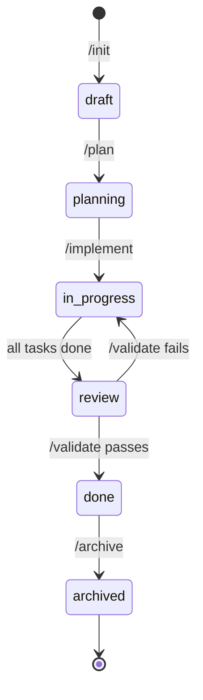
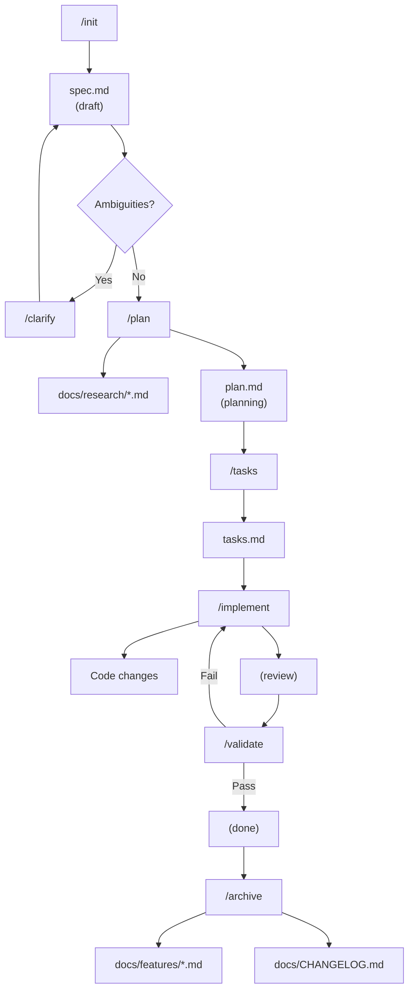

# Spec-Driven

Specification-driven development workflow for Claude Code with persistent artifacts.

> **Part of [claude-code-extras](https://github.com/adeonir/claude-code-extras)** - A curated marketplace of Claude Code plugins for feature development, debugging, frontend generation, and git helpers.

## Features

- Structured specification creation from descriptions or PRDs
- **Feature organization by sequential ID** (001-user-auth, 002-add-2fa)
- **Optional branch association** for automatic feature detection
- **Documentation discovery** (READMEs, diagrams, architecture docs)
- Codebase exploration and pattern analysis
- Technical planning with decisive architectural choices
- **Requirements Traceability** in plan.md (FR-xxx mapped to components)
- **Shared research** in docs/research/ for cross-feature reuse
- Task decomposition with dependency tracking
- **Requirements Coverage** in tasks.md (every FR-xxx has tasks)
- Granular implementation (single task, range, or all)
- **Three-level validation** (artifacts, consistency, code)
- **Planning completeness validation** (detects unplanned files)
- **Archive workflow** with documentation generation
- Semantic code operations via Serena MCP

## Installation

### Prerequisites

- [Claude Code](https://claude.ai/code) - Anthropic's official CLI for Claude
- [uv](https://github.com/astral-sh/uv) - Required by Serena MCP for semantic code operations

### Add Marketplace

First, add the marketplace to Claude Code (only needed once):

```bash
/plugin marketplace add adeonir/claude-code-extras
```

### Install Plugin

```bash
/plugin install spec-driven
```

This command automatically:
- Downloads the plugin from the marketplace
- Configures Serena MCP for semantic code operations
- Makes all commands available in your Claude Code session

## Quick Start

```bash
# 1. Create specification (gets sequential ID)
/spec-driven:init "Add user authentication with OAuth"

# 2. Resolve any ambiguities
/spec-driven:clarify

# 3. Generate technical plan (researches if needed)
/spec-driven:plan

# 4. Create task list
/spec-driven:tasks

# 5. Implement tasks
/spec-driven:implement              # Next pending task
/spec-driven:implement T001         # Single task
/spec-driven:implement T001-T005    # Range
/spec-driven:implement --all        # All pending

# 6. Validate and mark as done
/spec-driven:validate

# 7. Generate documentation
/spec-driven:archive
```

## Commands

| Command | Description |
|---------|-------------|
| `/spec-driven:init <description>` | Create feature specification with sequential ID |
| `/spec-driven:init --link ID` | Associate current branch to existing feature |
| `/spec-driven:clarify [ID]` | Resolve [NEEDS CLARIFICATION] items |
| `/spec-driven:plan [ID]` | Explore codebase and create technical plan |
| `/spec-driven:tasks [ID]` | Generate task list from plan |
| `/spec-driven:implement [ID] [scope]` | Execute implementation tasks |
| `/spec-driven:validate [ID]` | Validate artifacts, consistency, and code |
| `/spec-driven:archive [ID]` | Generate documentation and mark as archived |
| `/spec-driven:specs` | List all features by status |

## Feature Organization

Features are organized by sequential ID with optional branch association:

```
.specs/
├── 001-user-auth/
│   ├── spec.md
│   ├── plan.md
│   └── tasks.md
├── 002-add-2fa/
│   └── ...
└── 003-payment-flow/
    └── ...
```

Each spec.md has frontmatter metadata:

```yaml
---
id: 002
feature: add-2fa
status: in-progress
branch: feat/add-2fa  # optional
created: 2025-01-03
---
```

## Status Lifecycle



## Artifacts

### Working Files (.specs/ - gitignored)

```
.specs/
└── 002-add-2fa/
    ├── spec.md      # Requirements and acceptance criteria
    ├── plan.md      # Technical architecture and critical files
    └── tasks.md     # Trackable task list with dependencies
```

### Permanent Files (docs/ - committed)

```
docs/
├── research/
│   ├── totp-authentication.md   # Reusable research
│   └── stripe-payments.md
├── features/
│   └── authentication.md        # Feature docs by /archive
└── CHANGELOG.md                  # Centralized changelog
```

## Task Markers

Tasks are organized by category (Foundation, Implementation, Validation, Documentation) with markers for parallelization:

```markdown
## Foundation
- [ ] T001 [P] Create user schema         # Parallel-safe
- [ ] T002 [P] Setup auth provider        # Parallel-safe

## Implementation
- [ ] T003 [B:T001,T002] Implement login  # Blocked by T001 and T002
- [ ] T004 [B:T003] Add error handling    # Blocked by T003

## Validation
- [ ] T005 [B:T004] Run type checks       # Blocked by T004

## Documentation
- [ ] T006 [P] Update README              # Parallel-safe
```

## Workflow



Each phase reads previous artifacts to maintain context:
- `/plan` discovers project documentation, checks docs/research/ for existing research, outputs Requirements Traceability
- `/tasks` reads spec.md (FR-xxx, AC-xxx) and plan.md, outputs Requirements Coverage
- `/implement` reads spec (AC), plan (critical files), and research
- `/validate` validates artifacts, consistency, acceptance criteria, and planning completeness
- `/archive` generates feature documentation and updates centralized `docs/CHANGELOG.md`

## Serena MCP Integration

This plugin uses [Serena](https://github.com/oraios/serena) for semantic code operations:

| Phase | Tool | Benefit |
|-------|------|---------|
| `/plan` | `find_symbol` | Precise symbol location |
| `/plan` | `find_referencing_symbols` | Impact analysis |
| `/implement` | `insert_after_symbol` | Semantic edits |

Serena MCP is auto-configured via `.mcp.json` when you install the plugin.

## License

MIT
